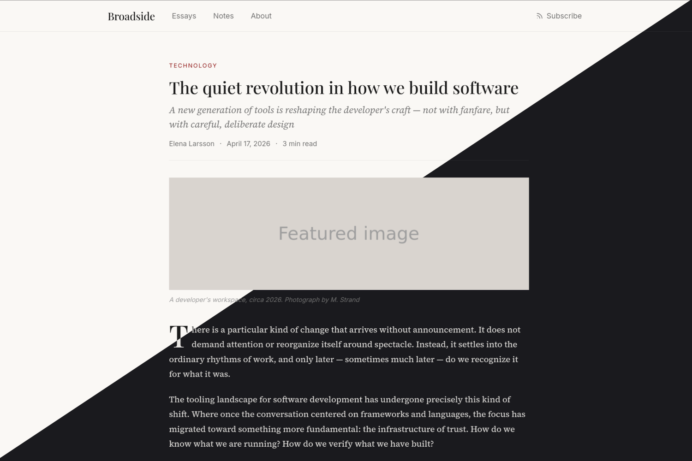

# Broadside

A clean, newspaper-inspired Zola theme. Typography-first, restrained, and confident — like a well-typeset broadsheet adapted for the web.



## Features

- **Typography-driven design** with high-contrast serif headlines and readable body text
- **Three-tier index layout**: featured post, two-column grid, text-only list
- **Drop caps** on article first paragraphs
- **Responsive** — collapses gracefully to single column on mobile
- **Automatic dark mode** via `prefers-color-scheme` — follows the user's OS setting
- **CSS custom properties** for easy color customization
- **RSS feed** support
- **Category taxonomy** with section listing pages
- **Previous / Next** post navigation
- **OpenGraph and Schema.org** support for improved SEO and social sharing

## Installation

Add the theme as a Git submodule in your Zola site:

```bash
git submodule add https://github.com/nsrosenqvist/broadside themes/broadside
```

Then set the theme in your `config.toml`:

```toml
theme = "broadside"
```

## Configuration

Here is a sample `config.toml` with all settings the theme expects:

```toml
base_url = "https://example.com"
title = "Broadside"
description = "A blog about software, security, and the craft of building things"
theme = "broadside"
compile_sass = true
generate_feeds = true
feed_filenames = ["rss.xml"]

[markdown]
highlight_code = true
highlight_theme = "css"

[[taxonomies]]
name = "categories"

[extra]
# Default author name shown on posts without a per-post author
author = "Your Name"

# Navigation links in the header
nav_links = [
  { name = "Essays", url = "/essays" },
  { name = "Notes", url = "/notes" },
  { name = "About", url = "/about" },
]

# --- Social & SEO (all optional) ---

# Fallback OpenGraph/Twitter image for pages without their own
# Path relative to the static/ directory
# default_og_image = "og-default.png"

# Twitter/X handle shown in twitter:site meta tag
# twitter_handle = "@yourhandle"

# Author URL used in Schema.org JSON-LD
# author_url = "https://example.com/about"

# Publisher logo URL for Schema.org JSON-LD (relative to static/)
# publisher_logo = "logo.png"

# Social profile URLs for rel="me" verification (Mastodon, GitHub, etc.)
# verification_links = [
#   "https://mastodon.social/@yourhandle",
#   "https://github.com/yourhandle",
# ]
```

## Post frontmatter

Posts support the following frontmatter:

```toml
+++
title = "The quiet revolution in how we build software"
date = 2026-04-17
description = "A new generation of tools is reshaping the developer's craft"

[taxonomies]
categories = ["Technology"]

[extra]
subtitle = "A new generation of tools is reshaping the developer's craft — not with fanfare, but with careful, deliberate design"
author = "Elena Larsson"
image = "featured.jpg"
image_caption = "A developer's workspace, circa 2026. Photograph by M. Strand"
+++
```

| Field | Required | Description |
|---|---|---|
| `title` | Yes | Post title |
| `date` | Yes | Publication date |
| `description` | No | Short description shown in post lists and meta tags |
| `[taxonomies] categories` | No | Category labels displayed above headlines |
| `[extra] subtitle` | No | Longer subtitle shown on the article page (falls back to `description`) |
| `[extra] author` | No | Author name (falls back to `config.extra.author`) |
| `[extra] image` | No | Featured image filename (co-located with the post) |
| `[extra] image_caption` | No | Caption displayed below the featured image |
| `[extra] og_image` | No | Override the OpenGraph/Twitter image (falls back to `image`, then `default_og_image`) |

## Social & SEO

The theme generates OpenGraph, Twitter Card, and Schema.org JSON-LD metadata automatically. All tags work out of the box using your `title`, `description`, and post frontmatter — the options below let you refine them.

### Site-level options (`[extra]`)

| Key | Description |
|---|---|
| `default_og_image` | Fallback image for social cards when a post has no featured image. Path relative to `static/`. |
| `twitter_handle` | Your Twitter/X handle (e.g. `"@yourhandle"`). Rendered as `twitter:site`. |
| `author_url` | URL for the author, used in the JSON-LD `Person` schema. |
| `publisher_logo` | Site logo for the JSON-LD `Organization` schema. Path relative to `static/`. |
| `verification_links` | List of profile URLs rendered as `<link rel="me">` for social verification (Mastodon, GitHub, Keyoxide, etc.). |

### Per-post image priority

The image used in `og:image` and `twitter:image` is resolved in this order:

1. `page.extra.og_image` — explicit social card override
2. `page.extra.image` — the post's featured image
3. `config.extra.default_og_image` — site-wide fallback

### Generated meta tags

**All pages** get: `og:site_name`, `og:type`, `og:title`, `og:description`, `og:url`, `twitter:card`, `twitter:title`, `twitter:description`, and a `WebSite` JSON-LD schema.

**Article pages** additionally get: `article:published_time`, `article:modified_time`, `article:author`, and an `Article` JSON-LD schema with `headline`, `datePublished`, `dateModified`, `wordCount`, `author`, and `publisher`.

### Social verification

To verify your site with Mastodon or similar services, add your profile URLs:

```toml
[extra]
verification_links = [
  "https://mastodon.social/@yourhandle",
  "https://github.com/yourhandle",
]
```

Each URL is rendered as `<link rel="me" href="...">` in the page head. Then add your site URL to your Mastodon profile's "Profile metadata" fields — Mastodon will follow the link, find the matching `rel="me"` tag, and show a green verification badge.

## Customization

All design tokens are CSS custom properties defined in `:root` in `sass/_variables.scss`. Both light and dark palettes are provided — override the relevant block to adjust either mode:

```scss
:root {
  --bg:              #faf8f5;    // Background
  --text-primary:    #1a1a1a;    // Body text
  --text-secondary:  #6b6b6b;    // Subtitles, metadata
  --text-tertiary:   #999;       // Dates, navigation
  --accent:          #8b0000;    // Links, category labels
  --border:          #e0ddd8;    // Rules and dividers
}

@media (prefers-color-scheme: dark) {
  :root {
    --bg:              #1a1a1e;
    --text-primary:    #e8e6e3;
    // ...
  }
}
```

Layout variables remain as Sass variables since they don't change between modes:

```scss
$content-width:   680px;      // Article max width
$wide-width:      960px;      // Site wrapper max width
```

### Syntax highlighting

The theme uses Zola's CSS-based syntax highlighting (`highlight_theme = "css"`). Syntax token colors are defined as `--syn-*` custom properties with light and dark variants. If you set `highlight_theme` to a named theme like `"base16-ocean-dark"`, Zola will inject inline styles that bypass the dark mode color scheme.

## License

MIT
