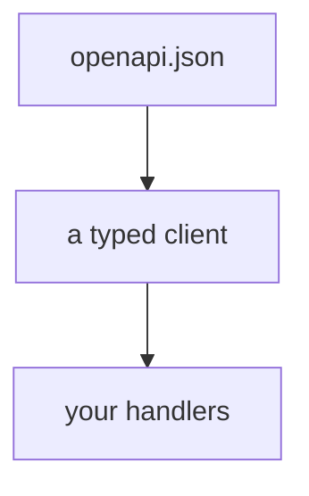

# Broadside

A clean, newspaper-inspired Zola theme. Typography-first, restrained, and confident — like a well-typeset broadsheet adapted for the web.


## Features

- **Typography-driven design** with high-contrast serif headlines and readable body text
- **Three-tier index layout**: featured post, two-column grid, text-only list
- **Drop caps** on article first paragraphs
- **Responsive** — collapses gracefully to single column on mobile
- **Automatic dark mode** via `prefers-color-scheme` — follows the user's OS setting
- **CSS custom properties** for easy color customization
- **RSS feed** support, including optional per-term feeds surfaced through a
  Subscribe dropdown in the header
- **Category and tag taxonomies** with listing pages — one primary category
  per post as the kicker above the headline, tags for everything else
- **Series** support — a collapsed list of every entry, shown on each post in
  the series
- **Mermaid diagrams** prerendered to inline SVG at build time — no client-side
  JavaScript, drawn in the theme's palette in both colour schemes
- **Previous / Next** post navigation
- **OpenGraph and Schema.org** support for improved SEO and social sharing
- **AI transparency labelling** — an optional per-post provenance label in the
  metadata line, an editor's note at the foot, image credits, and a disclosure
  that travels with the RSS item

## Installation

Add the theme as a Git submodule in your Zola site:

```bash
git submodule add https://github.com/nsrosenqvist/broadside themes/broadside
```

Then set the theme in your `config.toml`:

```toml
theme = "broadside"
```

## Configuration

Here is a sample `config.toml` with all settings the theme expects:

```toml
base_url = "https://example.com"
title = "Broadside"
description = "A blog about software, security, and the craft of building things"
theme = "broadside"
compile_sass = true
generate_feeds = true
feed_filenames = ["rss.xml"]

# Class-based highlighting (Zola >= 0.22) — the theme ships its own palette
# for the emitted .z-* classes, so the generated giallo-*.css files in
# static/ are unused (a theme choice is still required by Zola).
[markdown.highlighting]
style = "class"
light_theme = "github-light"
dark_theme = "github-dark"

# `categories` is the primary taxonomy — the first one a post lists becomes
# the kicker above its headline and its label in every list. `tags` is
# optional: leave it out and the theme renders nothing for it.
[[taxonomies]]
name = "categories"
# Optional: a feed per term at /categories/<term>/rss.xml. Any taxonomy with
# feed = true is listed in the header's Subscribe dropdown, so leave it off
# for taxonomies with many terms (tags) unless you want them all in the menu.
feed = true

[[taxonomies]]
name = "tags"

# Optional. Declare it to group posts into series; see below. Leave feed off
# unless you want every series listed in the header's Subscribe menu.
[[taxonomies]]
name = "series"

[extra]
# Default author name shown on posts without a per-post author
author = "Your Name"

# Navigation links in the header
nav_links = [
  { name = "Essays", url = "/essays" },
  { name = "Notes", url = "/notes" },
  { name = "About", url = "/about" },
]

# --- Social & SEO (all optional) ---

# Fallback OpenGraph/Twitter image for pages without their own
# Path relative to the static/ directory
# default_og_image = "og-default.png"

# Twitter/X handle shown in twitter:site meta tag
# twitter_handle = "@yourhandle"

# Author URL used in Schema.org JSON-LD
# author_url = "https://example.com/about"

# Publisher logo URL for Schema.org JSON-LD (relative to static/)
# publisher_logo = "logo.png"

# Social profile URLs for rel="me" verification (Mastodon, GitHub, etc.)
# verification_links = [
#   "https://mastodon.social/@yourhandle",
#   "https://github.com/yourhandle",
# ]
```

## Post frontmatter

Posts support the following frontmatter:

```toml
+++
title = "The quiet revolution in how we build software"
date = 2026-04-17
description = "A new generation of tools is reshaping the developer's craft"

[taxonomies]
categories = ["Technology"]
tags = ["Tooling", "Craft"]

[extra]
subtitle = "A new generation of tools is reshaping the developer's craft — not with fanfare, but with careful, deliberate design"
author = "Elena Larsson"
image = "featured.jpg"
image_caption = "A developer's workspace, circa 2026. Photograph by M. Strand"
ai_text = "edited"
ai_image = "generated"
+++
```

| Field | Required | Description |
|---|---|---|
| `title` | Yes | Post title |
| `date` | Yes | Publication date |
| `description` | No | Short description shown in post lists and meta tags |
| `[taxonomies] categories` | No | The first one is the kicker above the headline and the label in post lists; any further ones join the tags below |
| `[taxonomies] tags` | No | Secondary topics, shown as `#hashtags` below the article header's metadata rule |
| `[extra] subtitle` | No | Longer subtitle shown on the article page (falls back to `description`) |
| `[extra] author` | No | Author name (falls back to `config.extra.author`) |
| `[extra] image` | No | Featured image filename (co-located with the post). Cropped to 3:2 in the homepage grid; full-bleed at its natural ratio on the article page and as the featured post |
| `[extra] image_caption` | No | Caption displayed below the featured image. Takes inline markdown |
| `[extra] og_image` | No | Override the OpenGraph/Twitter image (falls back to `image`, then `default_og_image`) |
| `[taxonomies] series` | No | The series this post belongs to. Only the first is used |
| `[extra] series_index` | No | Explicit position in the series. Only honoured when *every* entry in that series has one |
| `[extra] ai_text` | No | AI provenance of the article's text: `none`, `assisted`, `edited`, or `generated` (falls back to `default_text`). See [AI transparency](#ai-transparency) |
| `[extra] ai_note` | No | Replaces the site-wide sentence in this post's disclosure with one written for it. The label still comes from `ai_text` |
| `[extra] ai_image` | No | AI provenance of the article's imagery as a whole: `generated` or `edited` |
| `[extra] image_ai` | No | Overrides `ai_image` for the featured image alone; `none` opts it out |

## Social & SEO

The theme generates OpenGraph, Twitter Card, and Schema.org JSON-LD metadata automatically. All tags work out of the box using your `title`, `description`, and post frontmatter — the options below let you refine them.

### Site-level options (`[extra]`)

| Key | Description |
|---|---|
| `default_og_image` | Fallback image for social cards on pages with no image of their own. Path relative to `static/`. |
| `og_card` | Filename of a per-post generated card, e.g. `"og.png"`. When set, posts without an explicit `og_image` point at `<permalink>/<og_card>` instead of falling back to their featured image. See [Generated social cards](#generated-social-cards). |
| `twitter_handle` | Your Twitter/X handle (e.g. `"@yourhandle"`). Rendered as `twitter:site`. |
| `author_url` | URL for the author, used in the JSON-LD `Person` schema. |
| `publisher_logo` | Site logo for the JSON-LD `Organization` schema. Path relative to `static/`. |
| `verification_links` | List of profile URLs rendered as `<link rel="me">` for social verification (Mastodon, GitHub, Keyoxide, etc.). |

### Per-post image priority

The image used in `og:image` and `twitter:image` is resolved in this order:

1. `page.extra.og_image` — explicit social card override
2. `config.extra.og_card` — the generated per-post card, if configured
3. `page.extra.image` — the post's featured image
4. `config.extra.default_og_image` — site-wide fallback

Step 2 sits above the featured image deliberately. A hero is composed for the top of an article at whatever ratio suits it; a social card is 1200×630 and gets centre-cropped to that by every platform, so a site that generates real cards should never fall back to a crop of a hero. Sites that set no `og_card` keep the featured image as the fallback, which still beats one site-wide picture on every post.

### Generated social cards

The theme ships a script that renders a typographic 1200×630 card per post, matching the theme's palette and fonts:

```bash
npm install --save-dev playwright-core
npx playwright install chromium
```

```toml
[extra]
og_card = "og.png"                  # per-post cards at <permalink>/og.png
default_og_image = "og-default.png" # site-wide card for the rest
```

Then, from your site root, after every build:

```bash
zola build
node themes/broadside/scripts/build-og-images.mjs
```

It scans `public/` for pages whose `og:image` ends in your `og_card` filename, reads each page's title, date, category and author from the JSON-LD the theme already emits, and writes the card next to that page's `index.html`. It also renders `public/og-default.png` from the site's own name and description — that one card has no post to derive from, so `OG_SITE_KICKER` and `OG_SITE_TAGLINE` are there for when a `<meta>` description reads awkwardly under a headline that already states the site's name. Nothing in the script needs editing for your site — it takes everything from the built output.

Cards are cached by a hash of their rendered HTML in `.og-cache/`, so a rebuild only launches Chromium for posts whose metadata actually changed. Persist that directory between CI runs and most builds skip the browser entirely. Add it to your `.gitignore`.

| Variable | Effect |
|---|---|
| `OG_IMAGE_SKIP=1` | Skip generation entirely, for quick local builds |
| `OG_CARD_NAME` | Card filename, if `og_card` is not `og.png` |
| `OG_LOCALE` | Date locale (default `en-US`) |
| `OG_SITE_KICKER` | Kicker on the site-wide card (default: none) |
| `OG_SITE_TAGLINE` | Tagline on the site-wide card (default: the site description) |
| `SITE_ROOT` | Site root, if it isn't the working directory |

To restyle the cards, edit the four palette constants and the `shell()` template at the top of the script.

### Changing the fallback chain

If that order isn't what you want, override the `opengraph` block and set `og_image` yourself. The `twitter_card` and `jsonld` blocks reuse the variable rather than deriving it again, so one override moves all three tags — `opengraph` renders first, which is what makes that work:

```jinja



{# Whatever rule you want. This one never falls back to the featured image. #}

  

  

<meta property="og:type" content="article">
<meta property="og:title" content="{{ page.title }}">
<meta property="og:description" content="{{ page.description | default(value='') }}">
<meta property="og:url" content="{{ page.permalink }}">
<meta property="og:image" content="{{ og_image }}">
<meta property="article:published_time" content="{{ page.date }}">
<meta property="article:modified_time" content="{{ page.updated }}">

```

Calling `{{ super() }}` instead of writing the tags does **not** work: the parent block re-derives `og_image` before emitting anything, so it overwrites whatever you set. Copy the tags you need out of the theme's `page.html` — you own the drift from that point, so check them when upgrading.

### Generated meta tags

**All pages** get: `og:site_name`, `og:type`, `og:title`, `og:description`, `og:url`, `twitter:card`, `twitter:title`, `twitter:description`, and a `WebSite` JSON-LD schema.

**Article pages** additionally get: `article:published_time`, `article:modified_time`, `article:author`, and an `Article` JSON-LD schema with `headline`, `datePublished`, `dateModified`, `wordCount`, `author`, and `publisher`.

### Social verification

To verify your site with Mastodon or similar services, add your profile URLs:

```toml
[extra]
verification_links = [
  "https://mastodon.social/@yourhandle",
  "https://github.com/yourhandle",
]
```

Each URL is rendered as `<link rel="me" href="...">` in the page head. Then add your site URL to your Mastodon profile's "Profile metadata" fields — Mastodon will follow the link, find the matching `rel="me"` tag, and show a green verification badge.

## Series

Declare a `series` taxonomy and give posts a term:

```toml
[taxonomies]
series = ["Building a compiler"]
```

Every post in a series with more than one entry shows a collapsed `<details>` between the featured image and the body, summarising as `Part 2 of 5 · Building a compiler`. Expanding lists all entries in reading order, with the one you are reading marked and unlinked. A series of one renders nothing — there is no navigation to offer.

It's a `<details>`, so it opens, closes and takes keyboard focus with JavaScript disabled.

### Ordering

By default entries run oldest first, which is publication order. When that isn't reading order, number them:

```toml
[extra]
series_index = 3
```

The numbering is honoured only when **every** entry in the series carries a `series_index` — a partly-numbered series falls back to date order rather than guessing. The number shown to the reader is the position in the list, not your key, so you can start at 0 or leave gaps.

Only the first series a post lists is used, mirroring the rule that only the first category becomes the kicker.

## Callouts

Zola does not render GitHub's `> [!NOTE]` alert syntax — the marker comes through as literal text inside an ordinary blockquote, and there is no `[markdown]` option to turn it on. The theme ships a shortcode instead:

```jinja

Markdown **works** in here, with [links](/), `code` and lists.

```

| Argument | Required | Description |
|---|---|---|
| `kind` | No | `note` (the default), `tip`, `important`, `warning`, or `caution`. Sets the CSS modifier and, capitalised, the label |
| `label` | No | Replaces the label text when the standard word isn't the right one |

Any other `kind` also works and gets its own capitalised label, so a typo appears on the page as "Waring" rather than silently rendering as a note.

Callouts are set as an editorial sidebar — a rule, a small sans kicker, and body text a step down in emphasis — rather than a tinted box, so they sit beside a blockquote without competing with it. `warning` and `caution` take the accent colour; the rest stay grey, on the principle that colour should carry meaning rather than decorate. To give every kind its own hue, override `.callout--tip` and friends in your own Sass.

## Diagrams

Write a [Mermaid](https://mermaid.js.org) diagram as an ordinary fenced code block:

````markdown

```mermaid
graph TD
  spec["openapi.json"] --> client["a typed client"]
  client --> app["your handlers"]
```
````

A build script turns each fence into inline SVG, so what ships is the finished
drawing. There is no client-side runtime: a diagram costs a couple of kilobytes
instead of the ~1 MB of JavaScript Mermaid weighs in the browser, it renders
with JavaScript disabled, and it cannot shift the layout after paint.

```bash
npm install --save-dev mermaid playwright-core
npx playwright install chromium
```

Then, from your site root, after every build:

```bash
zola build
node themes/broadside/scripts/build-diagrams.mjs
```

Colours come from your compiled `style.css`, so a retuned palette gives
retuned diagrams with nothing to configure. Each diagram is rendered twice,
once per colour scheme — Mermaid bakes concrete colours into its SVG and
derives shades from them, so a CSS custom property cannot be handed to it —
and the stylesheet swaps the two under `prefers-color-scheme`. The result is
deliberately monochrome, drawn in the same greys and thin rules as the rest of
the page; a diagram that needs colour should ask for it with Mermaid's own
`classDef` and `style` statements.

| Variable | Effect |
|---|---|
| `MERMAID_SKIP=1` | Skip rendering entirely, for quick local builds |
| `MERMAID_FONT` | Label font family (default: the theme's Inter stack) |
| `SITE_ROOT` | Site root, if it isn't the working directory |

Rendered diagrams are cached in `.mermaid-cache/` by a hash of the source, the
palette and the Mermaid version, so a rebuild only launches Chromium for
diagrams that actually changed. Persist that directory between CI runs and most
builds skip the browser entirely. Add it to your `.gitignore`.

Three things worth knowing:

- **`zola serve` does not render diagrams.** Zola serves HTML from memory, so
  there is no built file for a post-build step to rewrite. A fence shows as its
  source text while you write, and as a diagram in `zola build` output — which
  is also the no-JavaScript fallback. To see diagrams locally, build and serve
  `public/` with any static server.
- **A diagram that does not parse fails the build**, deliberately, the way an
  unknown language in a fence does under `error_on_missing_language`. Shipping
  the source text in its place would hide the mistake.
- **Write special characters literally, not as Mermaid entity codes.** Labels
  are rendered as SVG `<text>` rather than embedded HTML, so `#35;` arrives as
  the literal string `&#35;` — write `#` and quote the label instead.

Diagrams scale down to fit the text column and are centred in it; one wide
enough to still overflow scrolls rather than being clipped, but is usually
better split in two.

## AI transparency

Optional. Declaring `[extra.ai_transparency]` at all is what switches it on; every string below has a built-in English default, so the block can be four lines or forty. With the block absent, the theme emits nothing — no markup, no feed change, no caption change.

The vocabulary follows the seams of the EU AI Act's Article 50 rather than a "was AI used, yes/no" flag, because the Act draws its lines in places a boolean cannot reach. Four postures for a post's text:

| Posture | Default label | What it says |
|---|---|---|
| `none` | Written without AI | No AI involved in the text |
| `assisted` | AI-assisted | AI used for standard editing without substantially altering the text or its meaning — the language of the Art. 50(2) exemption |
| `edited` | AI-drafted, human-edited | AI produced material, a human reviewed it, and a named person holds editorial responsibility — the Art. 50(4) exception |
| `generated` | AI-generated | AI-generated text published without human editorial review — the case where Art. 50(4) makes disclosure mandatory |

The label appears in the article's metadata line next to the byline, linked to an editor's note at the foot of the article, and the note travels with the RSS item as well. That last part matters: Art. 50(5) asks for disclosure "at the latest at the time of the first interaction or exposure", and for a feed subscriber that moment is in their reader, not on your site.

### Site configuration

```toml
[extra.ai_transparency]
# The posture a post inherits when it declares nothing
default_text = "none"

# Label posts with no AI involvement too. Worth considering: if only
# AI-touched posts carry a label, an unlabelled post is ambiguous between
# "written by hand" and "the author forgot"
show_when_none = true

# The named person or entity holding editorial responsibility — the condition
# the Art. 50(4) exception is granted against. Falls back to the post author,
# then to config.extra.author
editorial_responsibility = "Your Name"

# Optional link from the note to a policy or colophon page. Omit it, or set
# it empty, and the note still appears — it just doesn't link onwards
policy_url = "/colophon"
policy_label = "How I use AI"

# Every visible string can be replaced. Defaults shown
heading = "AI transparency"
label_none = "Written without AI"
label_assisted = "AI-assisted"
label_edited = "AI-drafted, human-edited"
label_generated = "AI-generated"
note_none = "This article was written without the use of AI."
note_assisted = "A language model was used for research and copy-editing. The substance of the text is the author's own."
note_edited = "…"   # defaults to a sentence naming editorial_responsibility
note_generated = "This text was generated by a language model and published without human editorial review."
note_image_generated = "Imagery in this article was generated with an AI model."
note_image_edited = "Imagery in this article was altered with AI tools."
credit_image_generated = "Generated with an AI model."
credit_image_edited = "Altered with AI tools."
```

These strings are inserted without escaping so you can emphasize a word, which also means you are responsible for what you put in them.

Omitting any of them gets you the default above. The one key where empty means something different is `policy_url`: leaving it empty (or out) drops the link from the note while the disclosure itself stays, since whether you have a policy page to link to has no bearing on whether the article needs labelling. An empty `policy_label` falls back to the default text rather than leaving a bare arrow.

### Saying something specific about one post

A site-wide sentence has to be bland enough to fit every post that shares a posture. Where a particular piece deserves a precise account, `ai_note` replaces it:

```toml
[extra]
ai_text = "assisted"
ai_note = "The prose is mine. A model helped with the benchmark tables and caught two factual errors before publication."
```

The label in the byline still comes from `ai_text`, so the vocabulary stays comparable across the archive — a reader scanning your posts sees the same four labels meaning the same four things, and only the explanation gets specific. The note replaces the site-wide sentence rather than appending to it; a post-level statement about imagery, if any, still follows it.

Writing an `ai_note` is treated as an intent to disclose, so a post carrying one shows its label and note even where the settings would otherwise stay silent. Per-post wording is available for the note only, not for the labels.

### Images

Art. 50(4)'s first subparagraph is about the picture, not about where it sits on the page — a generated diagram halfway down a post is as in scope as the one at the top. So provenance is declared at three levels, narrowing as they go:

| Where | Effect |
|---|---|
| `[extra] ai_image` | A claim about the article's imagery as a whole. Adds a sentence to the note at the foot, and supplies the default posture for the featured image |
| `[extra] image_ai` | The featured image alone, overriding the above. Set `none` when the hero is a real photograph but the post carries a blanket claim |
| `{{ figure(ai="…") }}` | One body image, stated at the point of use |

A body image's posture is never inherited from `ai_image` — a blanket claim should not silently credit a photograph somebody took with a camera. Credits appear in the image's caption line, which is where a newspaper already prints "Photograph by …".

### The `figure` shortcode

```jinja
{{ figure(src="chart.png", alt="Reliability over time", caption="System reliability over time.", ai="generated") }}
```

| Argument | Required | Description |
|---|---|---|
| `src` | Yes | Image filename, resolved against the page; absolute and `http(s)` URLs pass through |
| `alt` | No | Alt text (falls back to `caption`) |
| `caption` | No | Caption below the image. Takes inline markdown, so `` `code` ``, *emphasis* and links all work |
| `ai` | No | `generated` or `edited`; adds a provenance credit to the caption line |

Plain markdown `` keeps working and remains the right thing for an image needing neither a caption nor a credit.

### What this does and does not do

It labels. It is not a compliance product, and this is not legal advice.

Worth knowing before you configure it: Article 50's machine-readable marking duty falls on providers of generative AI systems, not on you as a publisher, so the theme emits no watermark or provenance metadata. The text disclosure duty binds deployers publishing AI-generated text "to inform the public on matters of public interest", and does not apply where the content had human review and a named person holds editorial responsibility — which is why `edited` exists and why `editorial_responsibility` is a configuration key rather than a string in a template. A personal, non-professional blog may fall outside the Regulation altogether.

## Customization

All design tokens are CSS custom properties defined in `:root` in `sass/_variables.scss`. Both light and dark palettes are provided — override the relevant block to adjust either mode:

```scss
:root {
  --bg:              #faf8f5;    // Background
  --text-primary:    #1a1a1a;    // Body text
  --text-secondary:  #6b6b6b;    // Subtitles, metadata
  --text-tertiary:   #999;       // Dates, navigation
  --accent:          #8b0000;    // Links, category labels
  --border:          #e0ddd8;    // Rules and dividers
}

@media (prefers-color-scheme: dark) {
  :root {
    --bg:              #1a1a1e;
    --text-primary:    #e8e6e3;
    // ...
  }
}
```

Layout variables remain as Sass variables since they don't change between modes:

```scss
$content-width:   680px;      // Article max width
$wide-width:      960px;      // Site wrapper max width
```

### Syntax highlighting

The theme uses Zola's CSS-based syntax highlighting (`highlight_theme = "css"`). Syntax token colors are defined as `--syn-*` custom properties with light and dark variants. If you set `highlight_theme` to a named theme like `"base16-ocean-dark"`, Zola will inject inline styles that bypass the dark mode color scheme.

## License

MIT
