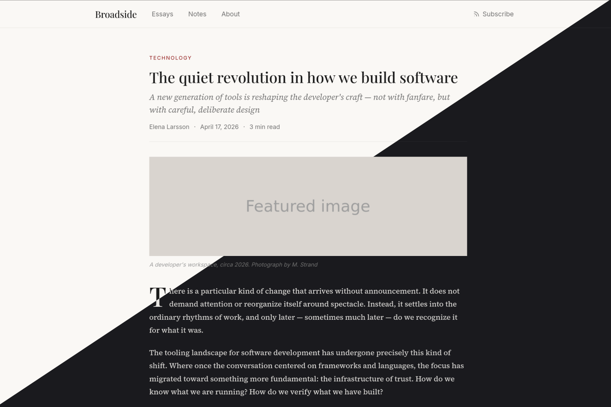

# Broadside

A clean, newspaper-inspired Zola theme. Typography-first, restrained, and confident — like a well-typeset broadsheet adapted for the web.



## Features

- **Typography-driven design** with high-contrast serif headlines and readable body text
- **Three-tier index layout**: featured post, two-column grid, text-only list
- **Drop caps** on article first paragraphs
- **Responsive** — collapses gracefully to single column on mobile
- **Automatic dark mode** via `prefers-color-scheme` — follows the user's OS setting
- **CSS custom properties** for easy color customization
- **RSS feed** support, including optional per-term feeds surfaced through a
  Subscribe dropdown in the header
- **Category and tag taxonomies** with listing pages — one primary category
  per post as the kicker above the headline, tags for everything else
- **Previous / Next** post navigation
- **OpenGraph and Schema.org** support for improved SEO and social sharing
- **AI transparency labelling** — an optional per-post provenance label in the
  metadata line, an editor's note at the foot, image credits, and a disclosure
  that travels with the RSS item

## Installation

Add the theme as a Git submodule in your Zola site:

```bash
git submodule add https://github.com/nsrosenqvist/broadside themes/broadside
```

Then set the theme in your `config.toml`:

```toml
theme = "broadside"
```

## Configuration

Here is a sample `config.toml` with all settings the theme expects:

```toml
base_url = "https://example.com"
title = "Broadside"
description = "A blog about software, security, and the craft of building things"
theme = "broadside"
compile_sass = true
generate_feeds = true
feed_filenames = ["rss.xml"]

# Class-based highlighting (Zola >= 0.22) — the theme ships its own palette
# for the emitted .z-* classes, so the generated giallo-*.css files in
# static/ are unused (a theme choice is still required by Zola).
[markdown.highlighting]
style = "class"
light_theme = "github-light"
dark_theme = "github-dark"

# `categories` is the primary taxonomy — the first one a post lists becomes
# the kicker above its headline and its label in every list. `tags` is
# optional: leave it out and the theme renders nothing for it.
[[taxonomies]]
name = "categories"
# Optional: a feed per term at /categories/<term>/rss.xml. Any taxonomy with
# feed = true is listed in the header's Subscribe dropdown, so leave it off
# for taxonomies with many terms (tags) unless you want them all in the menu.
feed = true

[[taxonomies]]
name = "tags"

[extra]
# Default author name shown on posts without a per-post author
author = "Your Name"

# Navigation links in the header
nav_links = [
  { name = "Essays", url = "/essays" },
  { name = "Notes", url = "/notes" },
  { name = "About", url = "/about" },
]

# --- Social & SEO (all optional) ---

# Fallback OpenGraph/Twitter image for pages without their own
# Path relative to the static/ directory
# default_og_image = "og-default.png"

# Twitter/X handle shown in twitter:site meta tag
# twitter_handle = "@yourhandle"

# Author URL used in Schema.org JSON-LD
# author_url = "https://example.com/about"

# Publisher logo URL for Schema.org JSON-LD (relative to static/)
# publisher_logo = "logo.png"

# Social profile URLs for rel="me" verification (Mastodon, GitHub, etc.)
# verification_links = [
#   "https://mastodon.social/@yourhandle",
#   "https://github.com/yourhandle",
# ]
```

## Post frontmatter

Posts support the following frontmatter:

```toml
+++
title = "The quiet revolution in how we build software"
date = 2026-04-17
description = "A new generation of tools is reshaping the developer's craft"

[taxonomies]
categories = ["Technology"]
tags = ["Tooling", "Craft"]

[extra]
subtitle = "A new generation of tools is reshaping the developer's craft — not with fanfare, but with careful, deliberate design"
author = "Elena Larsson"
image = "featured.jpg"
image_caption = "A developer's workspace, circa 2026. Photograph by M. Strand"
ai_text = "edited"
ai_image = "generated"
+++
```

| Field | Required | Description |
|---|---|---|
| `title` | Yes | Post title |
| `date` | Yes | Publication date |
| `description` | No | Short description shown in post lists and meta tags |
| `[taxonomies] categories` | No | The first one is the kicker above the headline and the label in post lists; any further ones join the tags below |
| `[taxonomies] tags` | No | Secondary topics, shown as `#hashtags` below the article header's metadata rule |
| `[extra] subtitle` | No | Longer subtitle shown on the article page (falls back to `description`) |
| `[extra] author` | No | Author name (falls back to `config.extra.author`) |
| `[extra] image` | No | Featured image filename (co-located with the post). Cropped to 3:2 in the homepage grid; full-bleed at its natural ratio on the article page and as the featured post |
| `[extra] image_caption` | No | Caption displayed below the featured image |
| `[extra] og_image` | No | Override the OpenGraph/Twitter image (falls back to `image`, then `default_og_image`) |
| `[extra] ai_text` | No | AI provenance of the article's text: `none`, `assisted`, `edited`, or `generated` (falls back to `default_text`). See [AI transparency](#ai-transparency) |
| `[extra] ai_image` | No | AI provenance of the article's imagery as a whole: `generated` or `edited` |
| `[extra] image_ai` | No | Overrides `ai_image` for the featured image alone; `none` opts it out |

## Social & SEO

The theme generates OpenGraph, Twitter Card, and Schema.org JSON-LD metadata automatically. All tags work out of the box using your `title`, `description`, and post frontmatter — the options below let you refine them.

### Site-level options (`[extra]`)

| Key | Description |
|---|---|
| `default_og_image` | Fallback image for social cards when a post has no featured image. Path relative to `static/`. |
| `twitter_handle` | Your Twitter/X handle (e.g. `"@yourhandle"`). Rendered as `twitter:site`. |
| `author_url` | URL for the author, used in the JSON-LD `Person` schema. |
| `publisher_logo` | Site logo for the JSON-LD `Organization` schema. Path relative to `static/`. |
| `verification_links` | List of profile URLs rendered as `<link rel="me">` for social verification (Mastodon, GitHub, Keyoxide, etc.). |

### Per-post image priority

The image used in `og:image` and `twitter:image` is resolved in this order:

1. `page.extra.og_image` — explicit social card override
2. `page.extra.image` — the post's featured image
3. `config.extra.default_og_image` — site-wide fallback

### Generated meta tags

**All pages** get: `og:site_name`, `og:type`, `og:title`, `og:description`, `og:url`, `twitter:card`, `twitter:title`, `twitter:description`, and a `WebSite` JSON-LD schema.

**Article pages** additionally get: `article:published_time`, `article:modified_time`, `article:author`, and an `Article` JSON-LD schema with `headline`, `datePublished`, `dateModified`, `wordCount`, `author`, and `publisher`.

### Social verification

To verify your site with Mastodon or similar services, add your profile URLs:

```toml
[extra]
verification_links = [
  "https://mastodon.social/@yourhandle",
  "https://github.com/yourhandle",
]
```

Each URL is rendered as `<link rel="me" href="...">` in the page head. Then add your site URL to your Mastodon profile's "Profile metadata" fields — Mastodon will follow the link, find the matching `rel="me"` tag, and show a green verification badge.

## AI transparency

Optional. Declaring `[extra.ai_transparency]` at all is what switches it on; every string below has a built-in English default, so the block can be four lines or forty. With the block absent, the theme emits nothing — no markup, no feed change, no caption change.

The vocabulary follows the seams of the EU AI Act's Article 50 rather than a "was AI used, yes/no" flag, because the Act draws its lines in places a boolean cannot reach. Four postures for a post's text:

| Posture | Default label | What it says |
|---|---|---|
| `none` | Written without AI | No AI involved in the text |
| `assisted` | AI-assisted | AI used for standard editing without substantially altering the text or its meaning — the language of the Art. 50(2) exemption |
| `edited` | AI-drafted, human-edited | AI produced material, a human reviewed it, and a named person holds editorial responsibility — the Art. 50(4) exception |
| `generated` | AI-generated | AI-generated text published without human editorial review — the case where Art. 50(4) makes disclosure mandatory |

The label appears in the article's metadata line next to the byline, linked to an editor's note at the foot of the article, and the note travels with the RSS item as well. That last part matters: Art. 50(5) asks for disclosure "at the latest at the time of the first interaction or exposure", and for a feed subscriber that moment is in their reader, not on your site.

### Site configuration

```toml
[extra.ai_transparency]
# The posture a post inherits when it declares nothing
default_text = "none"

# Label posts with no AI involvement too. Worth considering: if only
# AI-touched posts carry a label, an unlabelled post is ambiguous between
# "written by hand" and "the author forgot"
show_when_none = true

# The named person or entity holding editorial responsibility — the condition
# the Art. 50(4) exception is granted against. Falls back to the post author,
# then to config.extra.author
editorial_responsibility = "Your Name"

# Optional link from the note to a policy or colophon page. Omit it, or set
# it empty, and the note still appears — it just doesn't link onwards
policy_url = "/colophon"
policy_label = "How I use AI"

# Every visible string can be replaced. Defaults shown
heading = "AI transparency"
label_none = "Written without AI"
label_assisted = "AI-assisted"
label_edited = "AI-drafted, human-edited"
label_generated = "AI-generated"
note_none = "This article was written without the use of AI."
note_assisted = "A language model was used for research and copy-editing. The substance of the text is the author's own."
note_edited = "…"   # defaults to a sentence naming editorial_responsibility
note_generated = "This text was generated by a language model and published without human editorial review."
note_image_generated = "Imagery in this article was generated with an AI model."
note_image_edited = "Imagery in this article was altered with AI tools."
credit_image_generated = "Generated with an AI model."
credit_image_edited = "Altered with AI tools."
```

These strings are inserted without escaping so you can emphasize a word, which also means you are responsible for what you put in them.

Omitting any of them gets you the default above. The one key where empty means something different is `policy_url`: leaving it empty (or out) drops the link from the note while the disclosure itself stays, since whether you have a policy page to link to has no bearing on whether the article needs labelling. An empty `policy_label` falls back to the default text rather than leaving a bare arrow.

### Images

Art. 50(4)'s first subparagraph is about the picture, not about where it sits on the page — a generated diagram halfway down a post is as in scope as the one at the top. So provenance is declared at three levels, narrowing as they go:

| Where | Effect |
|---|---|
| `[extra] ai_image` | A claim about the article's imagery as a whole. Adds a sentence to the note at the foot, and supplies the default posture for the featured image |
| `[extra] image_ai` | The featured image alone, overriding the above. Set `none` when the hero is a real photograph but the post carries a blanket claim |
| `{{ figure(ai="…") }}` | One body image, stated at the point of use |

A body image's posture is never inherited from `ai_image` — a blanket claim should not silently credit a photograph somebody took with a camera. Credits appear in the image's caption line, which is where a newspaper already prints "Photograph by …".

### The `figure` shortcode

```jinja
{{ figure(src="chart.png", alt="Reliability over time", caption="System reliability over time.", ai="generated") }}
```

| Argument | Required | Description |
|---|---|---|
| `src` | Yes | Image filename, resolved against the page; absolute and `http(s)` URLs pass through |
| `alt` | No | Alt text (falls back to `caption`) |
| `caption` | No | Caption below the image |
| `ai` | No | `generated` or `edited`; adds a provenance credit to the caption line |

Plain markdown `` keeps working and remains the right thing for an image needing neither a caption nor a credit.

### What this does and does not do

It labels. It is not a compliance product, and this is not legal advice.

Worth knowing before you configure it: Article 50's machine-readable marking duty falls on providers of generative AI systems, not on you as a publisher, so the theme emits no watermark or provenance metadata. The text disclosure duty binds deployers publishing AI-generated text "to inform the public on matters of public interest", and does not apply where the content had human review and a named person holds editorial responsibility — which is why `edited` exists and why `editorial_responsibility` is a configuration key rather than a string in a template. A personal, non-professional blog may fall outside the Regulation altogether.

## Customization

All design tokens are CSS custom properties defined in `:root` in `sass/_variables.scss`. Both light and dark palettes are provided — override the relevant block to adjust either mode:

```scss
:root {
  --bg:              #faf8f5;    // Background
  --text-primary:    #1a1a1a;    // Body text
  --text-secondary:  #6b6b6b;    // Subtitles, metadata
  --text-tertiary:   #999;       // Dates, navigation
  --accent:          #8b0000;    // Links, category labels
  --border:          #e0ddd8;    // Rules and dividers
}

@media (prefers-color-scheme: dark) {
  :root {
    --bg:              #1a1a1e;
    --text-primary:    #e8e6e3;
    // ...
  }
}
```

Layout variables remain as Sass variables since they don't change between modes:

```scss
$content-width:   680px;      // Article max width
$wide-width:      960px;      // Site wrapper max width
```

### Syntax highlighting

The theme uses Zola's CSS-based syntax highlighting (`highlight_theme = "css"`). Syntax token colors are defined as `--syn-*` custom properties with light and dark variants. If you set `highlight_theme` to a named theme like `"base16-ocean-dark"`, Zola will inject inline styles that bypass the dark mode color scheme.

## License

MIT
