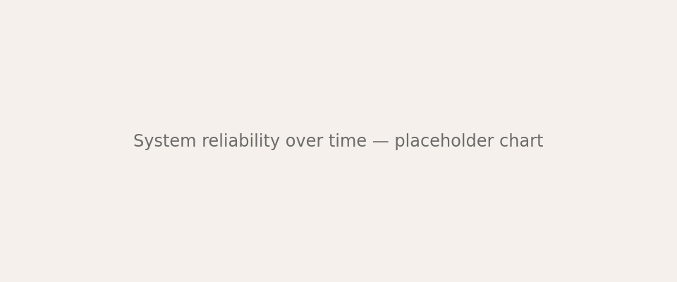

+++
title = "On the merits of boring technology"
date = 2026-04-03
description = "The unsexy stack choices that keep systems running for years"

[taxonomies]
categories = ["Engineering"]

[extra]
subtitle = "The unsexy stack choices that keep systems running for years"
author = "Marcus Chen"
image = "featured.png"
+++

There is a particular kind of engineer who gets excited about PostgreSQL. Not the latest version with its headline features, but PostgreSQL itself — the idea that a database can be reliable, well-documented, and fundamentally unchanged in its core promises for decades.

This essay is a defense of that engineer, and of the temperament that chooses stability over novelty.

## The innovation tax

Every new technology carries a hidden cost that its proponents rarely advertise: the cost of understanding it when things go wrong at 3 AM. This is the innovation tax, and it compounds.

A team running PostgreSQL, Redis, and a straightforward application server has a system that any competent engineer can debug. A team running the latest distributed database, a novel message queue, and a serverless compute layer has a system that requires specialists — specialists who may not be available when the pager goes off.

> "The best infrastructure is the kind you forget about. Not because it's unimportant, but because it's reliable."

### What boring actually means

Boring does not mean outdated. It means:

- **Well-understood failure modes.** When PostgreSQL fails, the error messages are clear and the solutions are documented.
- **Deep community knowledge.** Stack Overflow has answers. Books exist. Your colleagues have experience.
- **Predictable performance characteristics.** You know what to expect because thousands of teams have measured it before you.

## The compound interest of stability

Boring technology compounds. Each year of uptime is a year of not rewriting, not migrating, not debugging novel failure modes. That time gets invested in the product, in the user experience, in the things that actually differentiate your business.

The graph speaks for itself: teams that resist the urge to chase every new tool spend less time firefighting and more time building. Stability is not stagnation — it is a compounding advantage.

The exciting choice is rarely the right one. The right choice is the one you'll still be confident about in five years.
